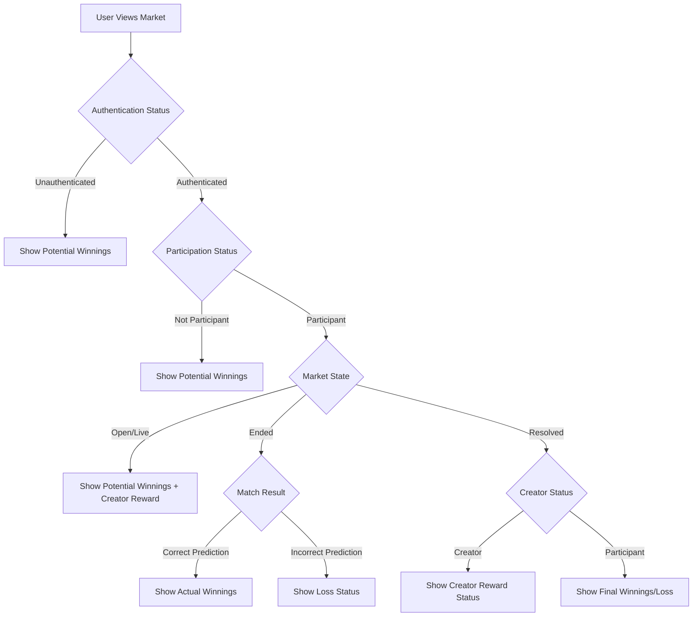

# Design Document

## Overview

The winnings display system enhances the CryptoScore prediction market platform by providing users with clear visibility into their potential and actual winnings based on their authentication status, participation level, and market state. The system integrates seamlessly with the existing market architecture while adding comprehensive financial outcome calculations.

## Architecture

### Component Integration

The winnings display system integrates with existing components:

- **MarketDetail.tsx**: Primary integration point for detailed winnings display
- **Market.tsx**: Basic winnings preview for market cards
- **MarketStats component**: Enhanced to show user-specific winnings information
- **ActionPanel component**: Updated to display winnings alongside action buttons

### Data Flow



## Components and Interfaces

### 1. WinningsCalculator Utility

**Purpose**: Centralized calculation logic for all winnings scenarios

**Interface**:
```typescript
interface WinningsCalculationParams {
  marketData: MarketData
  participantData?: ParticipantData
  userAddress?: string
  matchData?: EnhancedMatchData
}

interface WinningsResult {
  type: 'potential' | 'actual' | 'creator_reward' | 'none'
  amount: number // in lamports
  breakdown?: {
    participantWinnings?: number
    creatorReward?: number
  }
  status: 'eligible' | 'won' | 'lost' | 'distributed'
  message: string
}

class WinningsCalculator {
  static calculateWinnings(params: WinningsCalculationParams): WinningsResult
  static calculatePotentialWinnings(marketData: MarketData, prediction?: 'Home' | 'Draw' | 'Away'): number
  static calculateActualWinnings(marketData: MarketData, participantData: ParticipantData): number
  static calculateCreatorReward(marketData: MarketData): number
  static isUserCreator(marketData: MarketData, userAddress?: string): boolean
}
```

### 2. WinningsDisplay Component

**Purpose**: Reusable component for displaying winnings information

**Interface**:
```typescript
interface WinningsDisplayProps {
  marketData: MarketData
  participantData?: ParticipantData
  userAddress?: string
  matchData?: EnhancedMatchData
  currency: 'SOL' | 'USD' | 'NGN'
  exchangeRates: { SOL_USD: number, SOL_NGN: number } | null
  variant?: 'compact' | 'detailed'
  showBreakdown?: boolean
}

export function WinningsDisplay(props: WinningsDisplayProps): JSX.Element
```

### 3. Enhanced MarketStats Component

**Purpose**: Integrate winnings display into existing market statistics

**Updates**:
- Add winnings section after existing stats
- Show different information based on user state
- Include visual indicators for winning/losing status

### 4. useWinnings Hook

**Purpose**: Reactive hook for winnings calculations with caching

**Interface**:
```typescript
interface UseWinningsResult {
  winnings: WinningsResult | null
  isLoading: boolean
  error: string | null
  refetch: () => void
}

export function useWinnings(
  marketAddress?: string,
  userAddress?: string
): UseWinningsResult
```

## Data Models

### WinningsResult Extended

```typescript
interface WinningsResult {
  type: 'potential' | 'actual' | 'creator_reward' | 'none'
  amount: number // in lamports
  breakdown?: {
    participantWinnings?: number
    creatorReward?: number
    totalPool?: number
    winnerCount?: number
  }
  status: 'eligible' | 'won' | 'lost' | 'distributed' | 'pending'
  message: string
  displayVariant: 'success' | 'warning' | 'info' | 'error'
  icon: string // Icon class for UI
}
```

### Market State Enum

```typescript
enum MarketDisplayState {
  OPEN_UNAUTHENTICATED = 'open_unauthenticated',
  OPEN_AUTHENTICATED_NON_PARTICIPANT = 'open_authenticated_non_participant', 
  OPEN_PARTICIPANT = 'open_participant',
  OPEN_CREATOR_PARTICIPANT = 'open_creator_participant',
  OPEN_CREATOR_NON_PARTICIPANT = 'open_creator_non_participant',
  ENDED_PARTICIPANT_WINNER = 'ended_participant_winner',
  ENDED_PARTICIPANT_LOSER = 'ended_participant_loser',
  ENDED_CREATOR_PARTICIPANT = 'ended_creator_participant',
  ENDED_CREATOR_NON_PARTICIPANT = 'ended_creator_non_participant',
  RESOLVED_PARTICIPANT_WINNER = 'resolved_participant_winner',
  RESOLVED_PARTICIPANT_LOSER = 'resolved_participant_loser',
  RESOLVED_CREATOR = 'resolved_creator'
}
```

## Error Handling

### Calculation Errors

- **Invalid Market Data**: Graceful fallback to basic market information
- **Missing Exchange Rates**: Default to SOL display with warning
- **Network Errors**: Cached data with stale indicator

### Display Errors

- **Component Render Failures**: Error boundary with fallback UI
- **Currency Conversion Errors**: Fallback to SOL with error message
- **Missing User Data**: Show appropriate "Connect Wallet" messaging

## Testing Strategy

### Unit Tests

1. **WinningsCalculator Tests**
   - Test all calculation scenarios from requirements
   - Edge cases: zero participants, single participant, large pools
   - Fee calculation accuracy (2% creator, 3% platform, 95% participants)

2. **WinningsDisplay Component Tests**
   - Render tests for all user states
   - Currency formatting accuracy
   - Responsive design validation

3. **useWinnings Hook Tests**
   - Data fetching and caching behavior
   - Error handling scenarios
   - State transitions

### Integration Tests

1. **Market Detail Page Integration**
   - Full user journey through different states
   - Real market data scenarios
   - Wallet connection/disconnection flows

2. **Currency Context Integration**
   - Currency switching with winnings display
   - Exchange rate updates
   - Fallback scenarios

### Visual Regression Tests

1. **Component Appearance**
   - Different winnings states
   - Currency variations
   - Responsive breakpoints

## Implementation Phases

### Phase 1: Core Calculation Logic
- Implement WinningsCalculator utility
- Add unit tests for all calculation scenarios
- Integrate with existing fee configuration

### Phase 2: Display Components
- Create WinningsDisplay component
- Implement useWinnings hook
- Add to MarketStats component

### Phase 3: Market Detail Integration
- Update MarketDetail page with winnings display
- Enhance ActionPanel with winnings information
- Add visual indicators and status messages

### Phase 4: Market Card Preview
- Add basic winnings preview to Market component
- Implement compact display variant
- Ensure performance optimization

### Phase 5: Testing and Polish
- Comprehensive testing suite
- Performance optimization
- Accessibility improvements
- Documentation updates

## Performance Considerations

### Calculation Optimization
- Cache winnings calculations in useWinnings hook
- Memoize expensive calculations with useMemo
- Debounce currency conversion updates

### Rendering Optimization
- Use React.memo for WinningsDisplay component
- Lazy load detailed breakdowns
- Optimize re-renders with proper dependency arrays

### Data Fetching
- Leverage existing market data queries
- Avoid duplicate API calls
- Implement proper error boundaries

## Accessibility

### Screen Reader Support
- Proper ARIA labels for winnings amounts
- Descriptive text for status indicators
- Semantic HTML structure

### Visual Accessibility
- High contrast colors for status indicators
- Clear typography hierarchy
- Responsive design for all screen sizes

### Keyboard Navigation
- Focusable interactive elements
- Logical tab order
- Keyboard shortcuts for common actions

## Security Considerations

### Data Validation
- Validate all market data before calculations
- Sanitize user inputs
- Prevent calculation overflow/underflow

### Display Security
- Format numbers safely to prevent XSS
- Validate currency conversion rates
- Secure handling of wallet addresses

### Privacy
- No sensitive data logging
- Respect user privacy preferences
- Secure storage of cached calculations